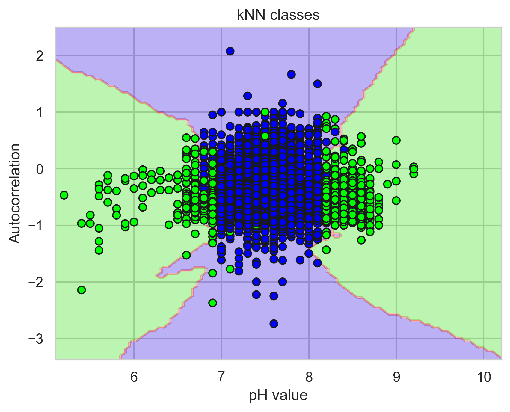

## Roadmap

This roadmap includes recommendations on how to continue to develop the tool in this Github repository to best suit DWR's changing needs.

### Integrating with Aquarius
This section will include recommendations on how to incorporate the Aquarius API into the tool. @JamesSLogan

### Transitioning to a fully automatic pipeline
This section will include recommendations on how to transition from our current outlier detection approach, which requires a human in the loop, to a fully automatic approach. Transitioning to a fully automatic pipeline requires change management at DWR. @JamesSLogan

### Including machine learning methods
We developed [a prototype machine learning model (see `dwr/ml_example.ipynb`)](https://github.com/cagov/caldata-dsa-dwr/blob/main/dwr/ml_example.ipynb) to detect outliers in water quality data. As a test, we attempted to automatically identify outliers in [35 years of pH data, from 1989 to 2024, from the Barker Slough Pumping Plant (BKS)](https://github.com/cagov/caldata-dsa-dwr/blob/main/dwr/sample_data/sample_data_BKS.csv) following the methodology outlined in [Talagala et al., 2019](http://dx.doi.org/10.1029/2019WR024906).

The Barker Slough Pumping Plant data available on the [California Data Exchange Center (CDEC)](https://cdec.water.ca.gov/), however, do not contain any information about data quality. Ideally, each data point should contain a basic label identifying good or bad quality data. A more sophisticated approach includes more informative labels for bad quality data (e.g. a power outage or an unphysical reading). In order to build a supervised machine learning model, which relies on labelled data, we created synthetic labels by using the tool to perform 6 statistical tests and adding some random noise.

Next, we derived six simple features from the time series data -- such as the autocorrelation of the pH within a one-week rolling window with the week prior -- using the Python package [`tsfresh`](https://tsfresh.readthedocs.io/en/latest/). Second, we split the 35-year data set into a training set, consisting of the first 24.5 years of data, and a testing set, which consisted of the rest. And finally, we selected a simple, easy-to-visualize algorithm called k- nearest neighbors algorithm to identify outliers. K- nearest neighbors identifies outliers by plotting all the derived features and identifying points that fall outside of a prescribed cluster. See Figure 1 for an example of our results. The plot shows a two-dimensional cut through the feature space; the x-axis shows the pH, while the y-axis shows the autocorrelation. The orange lines show the decision boundary. Purple points represent inliers, while green ones represent outliers.

Here are our recommendations for developing a robust machine learning model, used in day-to-day operations, to automatically identify outliers in water quality data:
* **Update CDEC data with labels that identify the quality of each data point.** Formulate a standardized list of informative reasons for bad data quality.
* **Research methods to create a sufficiently large training dataset.** Here, we used data from one station to train the model. We cannot use one aggregate training dataset, with data from every station, in the model. Wildly different behaviors will introduce uncertainty into the model and produce erroneous predictions. Instead, we advise grouping stations with similar behavior. One approach is to create geographic groups of stations. Another is to group stations by climate classification
* **Develop infrastructure needed to conduct machine learning experiments.** Raw data from O&M is not publicly available. In an ideal case, we should perform the analysis in the same place as the data -- e.g. store the data cloud computing environment and co-locate the code with the compute. Ideally, we should also use a tool to track experiments (e.g. [MLflow](https://mlflow.org)).

### Developing an analysis-ready dataset
This section will include a recommendations on how to develop an analysis-ready dataset.

### Developing additional features
This section will include a prioritized list of recommendations on how to further develop the tool, identified from two rounds of usability testing.
